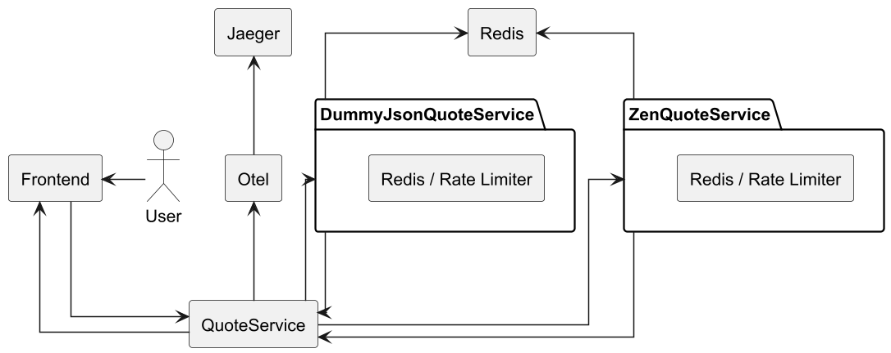
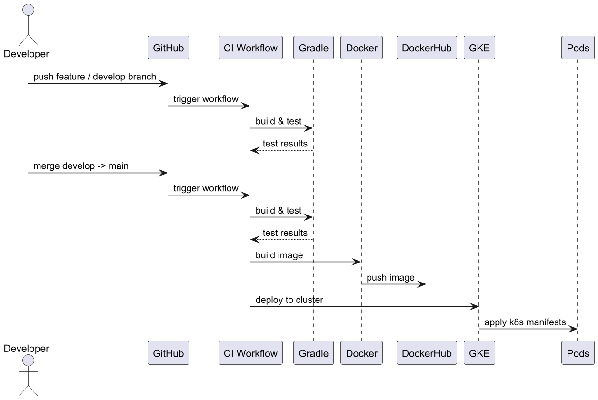

# Quote API

This project serves as a demo for the Kabisa coding assignment and consists of two parts.

The first part features a Java Spring-Boot API that fetches random quotes from two external APIs, returns the
fastest response, deals with errors, applies rate-limiting and much more.

The second part of the assignment is a CI/CD pipeline implemented with GitHub Actions.
It automates building and testing the application, generating Docker images, pushing
them to Docker Hub, and performing blue/green deployments to a Kubernetes cluster in Google Cloud.

---

## Table of Contents
- [Project Overview](#project-overview)
- [Code Flow & Deployment](#code-flow--deployment)
- [Tech Stack](#tech-stack)
- [How to Run](#how-to-run)

---

## Project Overview

### Features
- **Quote-API**
    - ✅ Return a random quote (from multiple external APIs)
        - ✅ Concurrently return only the fastest response
        - ✅ Handle external API errors (1 fails, 2 fails, or both fail)
    - ✅ Rate quotes (1–5 stars) and retrieve the highest rates quotes
        - ✅ Persist rated quotes to MySQL
    - ✅ Rate limiting using Redis
    - ✅ Frontend using Thymeleaf (and Tailwind CSS)
    - ✅ Observability using OpenTelemetry metrics and Jaeger UI
    - ✅ Rest endpoints for API interaction with Swagger and Postman
    - ✅ Tests
        - ✅ Unit
        - ✅ Integration
    - ✅ Docker-compose for local development
    - ✅ Git for version control (with Git Flow strategy)

- **CI/CD**
    - **When pushed to Develop branch**
        - ✅ Build and test the application
    - **When pushed to Main branch**
        - ✅ Build and test the application
        - ✅ Push Docker image to Docker Hub
        - ✅ Deploy to blue/green in Kubernetes
        - ✅ Rollout new deployment and switch service selector

### Ideas for further improvement
- Add Code Quality checks (PMD, Checkstyle, SpotBugs)
- Add test coverage checks (JaCoCo)
- Split CI/CD into separate files
- Add E2E tests
- Secure endpoints (JWT Authentication)
- Full CRUD on stored data (Delete/ Update)

---

## Code Flow & Deployment

### Get Random Quote Flow


### Deployment Flow


---

## Tech Stack
- Java 21
- Spring Boot
- Thymeleaf
- Spring Data JPA
- MySQL
- Redis
- OpenTelemetry + Jaeger
- Docker & Docker Hub
- Kubernetes (GKE)
- GitHub Actions (CI/CD)
- Gradle (Kotlin)

---

## How to Run
1. Clone the repository:
```bash
git clone https://github.com/DevYouriD/QuoteApi.git
```

2. Move into the root directory:
```bash
cd QuoteApi
```

3. Run docker-compose:
```bash
docker-compose up --build
```

4. Access the Frontend: http://localhost:8080
    - You can also query the API via Swagger at:
       http://localhost:8080/swagger-ui/index.html
